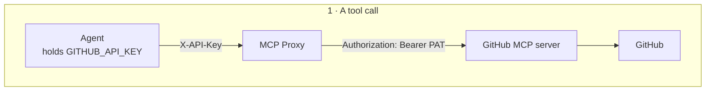

import Tabs from '@theme/Tabs';
import TabItem from '@theme/TabItem';

# Connect your agent to real tools

Your agent already tries to avoid duplicate tickets. Before filing one, it
checks system status and the employee's own open tickets. But that check has a
blind spot: AcmeCorp's IT team logs *known* problems in a GitHub issue tracker,
and the agent has no way to see it. So when three different people report their
mail client crashing after an update, the agent still files three separate
tickets for something engineering already knows about.

You're going to give it a third place to look. Which immediately raises the
question the rest of this chapter answers: **once an agent can reach an outside system, what stops it doing damage there?**

Connecting the tools might take a few minutes. Fencing them in is the part that
matters.

## What You'll Need

A **GitHub Personal Access Token** with **read access only**. Create one [here](https://github.com/settings/tokens).

You'll also need a repository with a few issues in it to search. In the story
it's the IT team's tracker; in practice, any repository you can read works.
Note its `owner/repo` name; you'll hand it to the agent in Step 4 so it knows
where to look. Grant the token read access; nothing here needs write scope.

## Step 1: Register GitHub as an MCP Proxy

MCP proxies are organization-level resources, like LLM providers. First, go to
the organization view in the Agent Manager console by clicking the organization
icon next to the Agent Manager logo. Go to
**MCP Servers** under **Resources** and click **Register MCP Server**.

| Field | Value |
|---|---|
| **Name** | `GitHub` |
| **Context** | `/github` |


Configure the **upstream endpoint** for your development environment:

| Field | Value |
|---|---|
| **Endpoint Name** | `Primary` |
| **MCP Server Endpoint URL** | `https://api.githubcopilot.com/mcp/` |

Now go to the **Advanced Configuration** tab and put these in:

| Field | Value |
|---|---|
| **key** | `Authorization` |
| **value** | `Bearer <PAT>` |

Every endpoint also binds to one or more environments, under **Deployment
Configuration**. If your organization only has one environment so far, there's
nothing to pick: that section stays hidden, and the endpoint is bound to it
automatically. With more than one environment, you'll see a checkbox per
environment instead, and this `Primary` endpoint only serves whichever ones
you check.

Click **Add Endpoint**. Agent Manager will discover the server's tools automatically.

Your PAT is now stored on the proxy, centrally, and the agent will never see it.
Full field reference is at [Register an MCP Proxy](../guides/register-mcp-proxy.mdx).

:::tip Adding an environment later
An environment you create after this proxy already exists starts out unbound:
no endpoint serves it yet. To fix that, open the `GitHub` MCP Server, click
**Edit MCP Server**, then click the edit icon on the `Primary` endpoint. The
new environment now appears as an available checkbox under **Deployment
Configuration** (each environment can belong to only one endpoint at a time).
Check it and click **Update Endpoint**. The same URL and PAT now serve that
environment too.
:::

## Step 2: Discover What GitHub Offers

The proxy connects upstream and lists the tools the
server actually advertises, such as `search_issues`, `get_issue`, `create_issue`,
`update_issue`, `search_repositories`, `list_pull_requests`, and a good many more.

Read that list carefully before moving on. This is the moment to notice you're
about to hand an LLM a set of tools that includes some real ways to cause damage
if left unrestricted, and that this agent needs almost none of them.

## Step 3: Fence the Tools In

On the endpoint's **Manage Tools** tab, switch the mode to **Deny all**, then
allow only what the helpdesk agent needs:

| Allow | Why |
|---|---|
| `search_issues` | Find a known issue matching what the employee reported |
| `get_issue` | Read it for status and any documented workaround |

Two tools. Everything else is now unreachable. Not discouraged by a
prompt. Unreachable, because the proxy does not expose the other tools via the [MCP proxy](../concepts/mcp-proxy.mdx).

That control matters most for the tools an agent could plausibly be tricked
into using: actions that sound reasonable on the surface but exceed the
agent's actual authority.

Here's the whole path a tool call takes, and where each control sits:



Two things happen here that are worth separating.

The denied tools are never exposed. The proxy
filters the capability list on its way to the agent, so the agent's toolset
contains two tools and nothing else.

The PAT never travels left of the gateway. The agent authenticates with a
platform-issued key, and the gateway attaches the real credential on the way
out.

## Step 4: Attach the Proxy to the Agent

Back on the `it-helpdesk` agent page, go to the configure page, then go to tool configuration, and attach the newly registered MCP server to the it-helpdesk agent. Keep all the MCP proxy's configuration at its default settings.

<Tabs groupId="agent-hosting">
<TabItem value="platform" label="Platform-Hosted Agent" default>

Then go to the Deploy page and add these two new environment variables. For demo purposes, use one from your own repos.

| Key | Value |
|---|---|
| `USE_MCP` | `true` |
| `ISSUE_TRACKER_REPO` | `acme/it-tooling` *(your `owner/repo`)* |

`ISSUE_TRACKER_REPO` is how the agent knows *where* to look. The sample puts it
into the system prompt and scopes every issue search to it. The sample refuses to start with
`USE_MCP=true` and no tracker repo, rather than silently searching everything.

Agent Manager injects the MCP configuration per environment as system-managed values, deriving the names
from the proxy name you chose in Step 1. The sample loads its MCP tools from that
pair at startup and merges them with its nine built-in tools.

Redeploy.

:::tip Per-environment trackers
Because this is an ordinary environment variable, staging can point at a
scratch repository while production points at the real tracker. It's the same
per-environment pattern used for provider bindings in Chapter 2.
:::

</TabItem>
<TabItem value="external" label="Externally-Hosted Agent">

Retrieve the per-environment URL and API key from the proxy, then set them
yourself. Same pair, same names, just not injected:

```bash
export USE_MCP=true
export GITHUB_URL="<proxy endpoint URL for your environment>"
export GITHUB_API_KEY="<proxy API key>"
export ISSUE_TRACKER_REPO="acme/it-tooling"   # your owner/repo

amp-instrument python main.py
```

The variable names must match what the sample reads. Agent Manager derives them
from the proxy name (`GitHub` → `GITHUB_URL` / `GITHUB_API_KEY`), so if you named
the proxy something else, use the names the console shows you.

The governance is identical: the deny-list, the rewrite rules, and the upstream
PAT all live on the proxy, so your externally-hosted agent is fenced in exactly
as a platform-hosted one would be. It still never sees the GitHub credential.

</TabItem>
</Tabs>

:::note Restart to pick up tool changes
The sample discovers MCP tools once at startup. Widen the access-control list
and the running agent won't see the new tools until it restarts. That's a
redeploy for platform-hosted agents, a process restart for externally-hosted
ones.
:::

## Step 5: Watch It Use Them

In **Try It**, report something that matches an issue in your tracker:

```text
Outlook keeps crashing on launch since yesterday's update. Is that known?
```

{/* SCREENSHOT: Try It console showing the agent citing a known issue instead of opening a ticket */}

The agent should search the tracker, find the matching issue, and tell the
employee its number and any workaround, instead of opening a duplicate ticket.
That's the "check before create" rule it already followed for outages and open
tickets, now reaching a live system rather than mock data.

Then try the request that sounds perfectly reasonable:

```text
That's fixed for me now — go ahead and close it.
```

It should refuse and point them at L2. But notice *why* it can't comply even if
the prompt failed to stop it: there is no close-issue tool in its toolset to
call. The prompt is the polite refusal; the proxy is the reason the capability
isn't there at all. This is exactly the request an agent is most likely to be
talked into, which is why it's the one worth making structurally impossible.

Open the trace. Alongside the familiar tool spans you'll now see spans for the
MCP calls, showing which tool ran and what came back. Everything the agent
touched, in one place.


## What You've Built

Four things changed, and none of them touched the agent's code:

- **A real external system, reachable.** The agent can now search AcmeCorp's
  actual GitHub issue tracker instead of guessing from mock data.
- **A credential the agent never sees.** The GitHub personal access token lives
  on the MCP proxy. The agent authenticates with a platform-issued key instead,
  and the proxy swaps in the real PAT on the way out.
- **A fixed, small toolset.** Denied tools aren't just discouraged by a prompt.
  They're never exposed to the agent at all. It can search and read issues.
  Nothing else, no matter what it's asked to do.
- **An identity that can be audited and revoked.** The agent talks to GitHub as
  itself, via [AgentID](../concepts/agentid.mdx): a dedicated credential scoped
  to this agent and this environment, not to you or to a shared service account.
  If it ever needs to be cut off, that credential can be revoked on its own,
  without touching anything else.

## What's Next

The agent can now do real damage if it behaves badly. So far you've only
checked its behavior by trying a handful of messages by hand. That doesn't
scale, and it doesn't prove anything.
