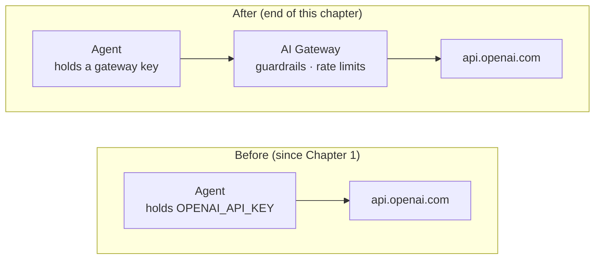

import Tabs from '@theme/Tabs';
import TabItem from '@theme/TabItem';

# Add guardrails to your agent

Your helpdesk agent works. Then the security team reviews it and files two objections:

1. Employees have discovered it will happily debug their personal
   side projects. It should refuse anything that isn't IT support.
2. Nobody can see what it's spending, and nothing stops one bad loop from burning
   the month's token budget.

## See It for Yourself

Before changing anything, open **Try It** on your agent and ask it something with
nothing to do with IT support:

```text
Write me a haiku about Kubernetes.
```

It responds with a perfectly decent haiku, which is completely outside the job of an IT helpdesk agent. Nothing here is
broken; the agent is doing what a helpful language model does. The system prompt
in Chapter 1 told it it was an IT helpdesk agent, but a prompt is guidance, not a
boundary. Ask nicely enough and the model will step outside it.


The obvious fix is to edit the system prompt and redeploy. That's rarely the
right move, for a few reasons:

- Compliance teams might want to update rules without relying on developers.
- Policy updates should go live immediately without waiting for a software release.
- Rules should be tracked in one central place instead of hiding them in prompt code.

Everything in this chapter happens **outside the agent**. Its code never changes.

## The Shape of the Fix

**Right now** the agent holds your raw `OPENAI_API_KEY` and calls
`api.openai.com` directly. That's how it's been running since Chapter 1.
Nothing sits between the agent and OpenAI, so nothing can inspect or block
what it sends or gets back.

**By the end of this chapter**, the agent won't hold an OpenAI key at all. It'll
hold a platform-issued gateway key instead, and every call will route through a
[gateway](../concepts/gateway.mdx) that enforces guardrails and rate limits
before the request ever reaches OpenAI:



The agent stops holding the upstream credential entirely. It gets a
platform-issued key and a gateway URL instead. Because every request now
passes through one place, that place can enforce things. The agent's code
never changes; only where its traffic goes does.
[LLM Service Provider](../concepts/llm-service-provider.mdx) explains why this
indirection exists.


## Step 1: Register OpenAI as an LLM Service Provider

Providers are managed at the organization level, so a single registration can be shared across all projects. To set this up:

1. Switch to the Organization view in the Agent Manager console by clicking the organization icon next to the Agent Manager logo.
2. Go to **LLM Service Providers** in the Resource section.
3. Click **Add Service Provider**.

Put the values listed below for the required inputs.

| Field | Value |
|---|---|
| **Name** | `Shared OpenAI` |
| **Version** | `v1.0` |
| **Context path** | `/openai` |


Select the OpenAI provider template. It fills in the upstream URL, auth type,
and API specification for you. Then supply your OpenAI key as the **upstream
credential**.

The **Resilience** tab allows you to set timeout parameters, which are useful for long-lived connections. For this tutorial, the default values are sufficient.

Now click **Add provider**.

This is the payoff: the key is stored once, centrally. When it rotates, you
edit it here and every agent using this provider picks it up. No
redeployments, and no agent ever held it in the first place.

## Step 2: Add the Guardrail

Navigate to the provider's Guardrails tab and select **Add Guardrail**. Search for **Prompt Decorator**, select it, and provide an instruction like the following:

For the prompt decorator config
```text
You handle IT support requests for AcmeCorp employees only: passwords, software
access, tickets, outages, and IT policy. If a request is not IT support, politely
decline and suggest the employee contact the relevant team. Never write code,
essays, or creative content.
```

Keep everything else at its default configuration and click Add.

Now scroll down and click Save to register the guardrail configuration.


Guardrails stack in three layers:
1. global on the provider (what you just did),
2. per-operation on the provider,
3. per-agent on the binding, so one agent can have stricter rules without imposing that on every other agent.

## Step 3: Point the Agent at the Provider

Go back to your `it-helpdesk` agent, open its configure section, and then go to the LLM configurations section.
Then click **Add LLM Configuration** to attach the `Shared OpenAI` LLM provider you created previously.


Change the variable name values to `LLM_PROVIDER_URL` and `LLM_PROVIDER_KEY`. Note that these values can be edited based on how you're referencing the provider in your agent's codebase.

Now save this. It triggers a redeploy of the agent, so wait until the agent finishes deploying.

<Tabs groupId="agent-hosting">
<TabItem value="platform" label="Platform-Hosted Agent" default>

Next, you need to update the environment variables. Navigate to the agent's Deploy page, locate the default environment deployment card, and click Configure under the Configurations and Secrets section.


Now add this new environment variable:

| Key | Value |
|---|---|
| `USE_LLM_PROVIDER` | `true` |

You do **not** add `LLM_PROVIDER_URL` or `LLM_PROVIDER_KEY`. Agent Manager injects
those as system-managed variables when the provider is attached. Observe that they're
read-only in the console environment variable section, so the agent can't be repointed at an ungoverned
endpoint by editing its config.

You can now delete the `OPENAI_API_KEY` env variable from the agent, since it no longer needs it.

Now click Apply. This redeploys the agent again, since you've changed its environment variables.

</TabItem>
<TabItem value="external" label="Externally-Hosted Agent">

From the configuration panel, copy the **Endpoint URL** and
**API Key** for your environment, then set them where your agent runs:

```bash
export USE_LLM_PROVIDER=true
export LLM_PROVIDER_URL="<endpoint URL from the console>"
export LLM_PROVIDER_KEY="<API key from the console>"

unset OPENAI_API_KEY     # the agent no longer needs it

amp-instrument python main.py
```

The same three variables the platform would have injected, set by hand. Your
agent now calls the gateway rather than OpenAI, so the guardrails apply to it
identically. The governance doesn't depend on who runs the workload. It
depends only on which URL the traffic goes to.

:::caution Copied values don't rotate themselves
This is the one place the external path is genuinely weaker. A platform-hosted
agent picks up a rotated upstream credential automatically, because it only ever
held the gateway key. Here, if you regenerate the provider's API key you must
update it wherever you exported it.
:::

</TabItem>
</Tabs>

## Step 5: Prove the Guardrail Works

In **Try It**, ask the question you started with:

```text
Write me a haiku about Kubernetes.
```

No haiku this time. It should decline and steer you back to IT support. Then
confirm you haven't broken the real job:

```text
I need my password reset. alice.chen@acmecorp.com, E-1001.
```

The agent's code, prompt, and tools are byte-for-byte what they were in Chapter 1.
The behavior changed because the request path changed.


## What You've Built

Off-topic requests refused and one central credential, neither of which required
touching the agent.

The division of labor here is the real lesson, and it maps onto
[roles](../concepts/organization.mdx#access-control): an **AI Lead** owns
providers and guardrails, a **Developer** owns the agent, and neither has to wait
on the other. A Developer can *connect* to a provider but not register or change
one.

## What's Next

You've now governed what the agent *says*. Off-topic requests get refused, and
spending is capped. But everything it *knows* still comes from mock data baked
into its own process. It has no tool that reaches a real, outside system.

That gap breaks one of the agent's own rules. It's supposed to check for
duplicate issues before opening a new support ticket, but AcmeCorp's IT team
tracks known problems in a GitHub issue tracker the agent simply can't see. So
right now, it dutifully keeps filing tickets for issues engineering already
knows about.

[Chapter 3](./give-the-agent-real-tools.mdx) fixes that: you'll connect the agent
to that real GitHub tracker, then lock down its access so reading issues is the
*only* thing it's able to do there.
