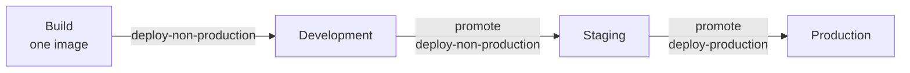

# Ship It to Production

The helpdesk agent works in development. It's governed, it has real tools it
can't abuse, and monitors prove it behaves. Now it has to serve actual
employees.

:::info This chapter needs a platform-hosted agent
Promotion, suspend, and endpoint security are all things Agent Manager can
only do for a workload it runs. If your agent is externally-hosted, follow
along to understand the model. The actions themselves won't be available to
you, and the deployment and endpoint security stay your responsibility. Only
[Step 7](#step-7-watch-it) applies to both.
:::

Production is not development with a different URL. It's a different
environment: different credentials, a different security posture, and most
importantly, different people allowed to touch it.

## Step 1: Set Up Your Environments and Pipeline

Before you can promote anything, your project needs at least two environments
in its deployment pipeline, and that pipeline has to be attached to the
project. Without that, there's nowhere to promote to. If you haven't set this
up yet, do it now: see
[Environment Management](../guides/environment-management.mdx).

An agent doesn't jump to production. It follows the
[deployment pipeline](../concepts/deployment-pipeline.mdx) attached to the
`it-support` project you created in [Chapter 1](./create-your-first-agent.mdx).
The pipeline defines the order environments may be traversed, typically
development, then staging, then production.



One image is built once and moves rightward. Each hop is a promotion, and the
last hop needs a permission the earlier ones don't.

:::note This usually happens earlier
In a real rollout, environments and the deployment pipeline are normally set
up before anyone creates an agent, since it's one-time platform setup rather
than a per-agent step. But it doesn't have to happen first. You can add
environments and update the pipeline later too, exactly like you're doing in
this chapter.
:::

If your installation only has a development environment, add staging and
production now. You need at least two to see a promotion happen.

After creating the environments, go to the **Deployment Pipelines** view on
the organization page. If the two new environments aren't visible in the
promotion chain yet, click **Edit Pipeline** and add them: **Default**,
**Staging**, and **Production**, in that order. Then click **Save**.

## Step 2: Configure the LLM and MCP for Your New Environments

Your `Shared OpenAI` provider from [Chapter 2](./govern-the-model.mdx) and
your `GitHub` MCP server from [Chapter 3](./give-the-agent-real-tools.mdx) are
each a single, organization-level resource. Creating a new environment
doesn't clone them. What a new environment does need is its own binding: a
connection that tells this agent which provider (or proxy) to use in that
specific environment.

Skip this and promotion won't silently misbehave. It will refuse outright,
with an error along these lines:

```text
Promotion blocked: no LLM/system configuration in "staging"
Promotion blocked: MCP configuration "GitHub" has no MCP server in "staging"
```

So before promoting anywhere, set up both bindings for staging and
production:

- **LLM binding**: on the `it-helpdesk` agent's configure page, open **LLM
  Configurations**. You'll see a tab per environment. Attach `Shared OpenAI`
  on the **Staging** and **Production** tabs the same way you attached it for
  Development in Chapter 2. Full detail:
  [Configure Agent LLM Configuration](../guides/configure-agent-llm-configuration.mdx).
- **MCP binding**: same idea, under **Tool Configurations**. Attach the
  `GitHub` MCP server to the **Staging** and **Production** tabs. Full
  detail: [Configure Agent MCP Proxies](../guides/configure-agent-mcp-proxies.mdx).

While you're there, each environment can point its binding at a different
target. Staging might use a cheaper model or a scratch GitHub repo.
Production points at the real thing. That's expected. Making the binding
per-environment is what makes it possible.

## Step 3: Promote to Staging

Go to the agent's deployment view, and promote the development deployment to
staging.

A promotion moves the deployment, not the build. The image that was tested in
development is the same image that runs in staging. Nothing gets rebuilt, so
nothing can drift between what you tested and what you shipped.

The promotion dialog also lets you set values specific to staging:

- **Environment Variables**: add or edit env keys for this environment. Give
  `AGENT_VERSION` a value distinguishable from development, like
  `1.0.0-staging`.
- **File Mounts**: any files specific to staging, if your agent needs some.
- **Use config from source environment**: a toggle that copies development's
  environment variables and file mounts over, instead of setting staging's
  from scratch. It only covers those two things. The LLM and MCP bindings
  from Step 2 stay per-environment no matter how this toggle is set.

That `AGENT_VERSION` value is why Chapter 1 had you set it. Call the staging
endpoint:

```bash
curl -s <staging-endpoint>/health
```

The response echoes `agent_version`, so "which build is actually running
here" is a question you can answer in one request rather than by reading
console pages.

## Step 4: Secure the Endpoint

Development was open because it was only you. Production is not.

Pick an authentication approach for the agent's endpoint:

- **[API keys](../guides/secure-agent-endpoints-with-api-keys.mdx)**:
  simplest. Good for server-to-server callers like an internal helpdesk
  portal.
- **[JWT authentication](../guides/secure-agents-with-jwt-authentication.mdx)**:
  use this when calls carry an end-user identity you want the agent to see.

{/* SCREENSHOT: Agent endpoint security configuration with an authentication method selected */}

If a browser app will call the agent directly, configure
[CORS](../guides/configure-cors-for-agent-endpoints.mdx). Restrict it to your
actual origins, not `*`.

:::info Platform-hosted only
All three are enforced at the gateway that fronts a platform-hosted agent's
endpoint. An externally-hosted agent's endpoint is yours, so authentication
and CORS on it are yours to implement. What you *do* still get from the
platform is everything on the outbound side: the LLM provider and MCP proxy
governance from Chapters 2 and 3, plus AgentID, traces, and evaluation.
:::

Identity providers are per environment: a token minted for staging is not
accepted in production, even for the same agent. That isolation is the
point.

## Step 5: Promote to Production

Run the seeded traffic against staging one more time. Confirm the monitors
from Chapter 4 are green. Then promote staging to production.

{/* SCREENSHOT: Promote dialog for staging to production, with the production configuration panel */}

You already attached production's LLM and MCP bindings in Step 2, so
promotion won't block on those. In the promotion dialog, set production's own
`AGENT_VERSION` (`1.0.0`) and any other environment-specific variables or
file mounts it needs. Same pattern as Step 3, just for production this time.

You may find you *can't* do this. That's the system working as intended.
Promoting into production requires `amp:agent:deploy-production`,
[a separate permission](../concepts/organization.mdx#production-is-a-separate-permission)
from the `amp:agent:deploy-non-production` you've been using all series. A
**Developer** typically has the non-production scope but not the production
one. A **Platform Engineer** has both.

The split is what makes the pipeline a control rather than a convention: the
pipeline decides the path, the permission decides who may move an agent
along it.

## Step 6: Know How to Stop It

Before you walk away, be certain you can stop this if something goes wrong.

**Suspend** stops a deployed agent without deleting it. Use it when the agent
is misbehaving and you'd rather it serve nothing than serve something wrong.
The agent's configuration, identity, and history survive. Only the workload
stops.

{/* SCREENSHOT: Deployment view for production with the suspend action available */}

Suspend is separately permissioned, and it's worth trying once in staging
now, while it's calm, rather than learning it during an incident.

## Step 7: Watch It

Production changes what you look at. The monitors from Chapter 4 keep
scoring, but now you should also check:

- **Deployment status per environment**: production can show **Deployed**
  while staging shows **Error**. Status is
  [tracked per environment](../concepts/agent-lifecycle.mdx#deployment-status-per-environment),
  never globally.
- **Rate limit headroom**: the limits from Chapter 2 were sized for testing.
- **Trace latency**: real employees notice what your test messages didn't.

## What You've Built

Across five chapters, without ever editing the agent's source:

| Chapter | What the platform did |
|---|---|
| 1 | Built from source, deployed, traced with zero instrumentation code |
| 2 | Centralized the model credential, added guardrails and rate limits |
| 3 | Connected real external tools, fenced them in, gave the agent an identity |
| 4 | Scored real behavior continuously against your own rules |
| 5 | Promoted through environments under a permission split, with suspend as a safety net |

The agent's code is identical to Chapter 1. Everything else was
configuration. That's the argument for running agents on a platform rather
than wiring each one by hand.

## Where to Go Next

- [Agent Kind & Agent Catalog](../concepts/agent-kind-and-catalog.mdx): publish this agent as a reusable template so other teams can deploy their own.
