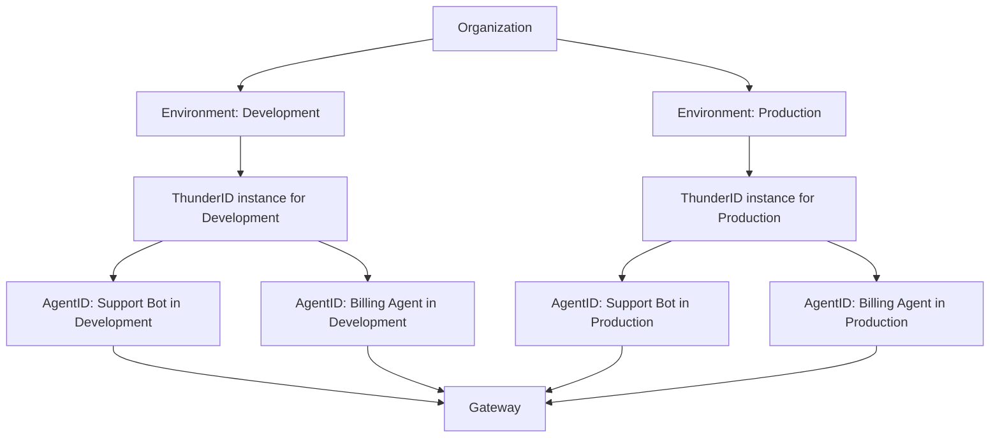

# AgentID

Every agent that calls an MCP tool through WSO2 Agent Manager does so through a gateway, and
that gateway needs to know who is calling. AgentID is what gives each agent its own identity for
this: a dedicated OAuth 2.0 `client_credentials` identity in every environment it runs in, so it
can request its own access token and use it to call the gateway.

## Overview

AgentID is built on two pieces working together.

1. **A dedicated identity provider for every environment.** Every environment gets its own
   ThunderID instance, created as part of setting up that environment. This instance is
   completely separate from every other environment's ThunderID instance, and from the Thunder
   identity provider that Agent Manager itself uses for console and API login.
2. **One OAuth 2.0 identity per agent, per environment.** When an agent is created, Agent Manager
   provisions this identity for every environment already in its organization; promoting the
   agent to a new environment provisions it there too. This is the agent's AgentID: a `client_id`
   and `client_secret` the agent can exchange for an access token whenever it needs to call the
   gateway.

Because each environment has its own ThunderID instance, the same agent gets a different
AgentID in every environment it is promoted to. A token minted in Development can never be used
against the Production gateway, since Production only trusts tokens issued by its own
environment's ThunderID instance.

## Platform-Hosted vs. Externally-Hosted Agents

AgentID provisioning works the same way for both agent types, but delivering the credential to
the agent is different, because Agent Manager only controls the runtime of one of them.

### Platform-Hosted Agents

For an agent that Agent Manager builds, deploys, and runs, the platform can deliver the
credential directly into the running workload. As soon as the agent's identity finishes
provisioning, its `client_id`, `client_secret`, token endpoint, and scopes are injected into the
pod as environment variables, backed by a Kubernetes secret. There is no manual retrieval step,
though your agent's own code does need a small amount of logic to use those environment
variables. See [Use AgentID in a Platform-Hosted Agent](../guides/use-agentid-in-platform-hosted-agents.mdx)
for the environment variables involved and the code your agent needs to mint and use a token.

### Externally-Hosted Agents

For an agent that runs outside the platform, Agent Manager has no workload to inject
credentials into. Instead, the agent's operator generates the credential from the agent's page
in the console: the `client_id` and a freshly minted `client_secret` are shown once, ready to
copy into the agent's own configuration. See
[Retrieve AgentID Credentials for an Externally-Hosted Agent](../guides/retrieve-agentid-for-externally-hosted-agents.mdx)
for the retrieval flow.

## Provisioning and Retry

AgentID provisioning happens automatically and asynchronously.

- When an agent is created, or promoted to a new environment, Agent Manager writes a pending
  identity record for that environment and attempts to create it in the background. A short
  delay between agent creation and the identity becoming available is expected.
- If provisioning fails, for example because the environment's ThunderID instance is briefly
  unreachable, it is retried automatically for a limited number of attempts, spread out over
  about fifteen minutes, before the identity is marked failed.
- You can re-trigger provisioning for a single environment at any time, without affecting the
  agent's identities in any other environment.

An identity moves through four states as it provisions: `pending`, `in_progress`, `completed`,
and `failed`.

## Where Credentials Are Stored

The `client_id` is stored in Agent Manager's own database for both agent types. Where the
`client_secret` lives depends on the agent type:

- **Platform-Hosted agents** need their secret available again on every deploy, promote, and pod
  restart, so it is stored in Agent Manager's secret store, the same pluggable backend used for
  other runtime secrets like MCP proxy credentials, and never written to Agent Manager's
  database or logs in plain text.
- **Externally-Hosted agents** have no running workload for Agent Manager to keep a secret in
  sync with, so nothing is stored at all. Each time you generate a secret from the console,
  Agent Manager asks the environment's ThunderID instance to mint a fresh one and hands it
  straight back to you. It exists only for that one response.

## Rotating and Revoking Credentials

You can regenerate an agent's AgentID secret for a specific environment at any time.
Regenerating issues a new secret immediately and invalidates the old one.

- For a Platform-Hosted agent, Agent Manager also triggers a rollout of the running pod so it
  picks up the new secret. This is best-effort: if the rollout itself fails, the response tells
  you so, but until then the pod keeps running with its old, now-invalidated secret. Restart it
  yourself if that happens.
- For an Externally-Hosted agent, generate a new one from the console the same way you generated
  the original, and update the agent's own configuration yourself.

You can also revoke a credential without immediately issuing a new one, which stops the agent
from minting new tokens with it. A revoked credential does not invalidate tokens that were
already issued before the revoke: those remain valid until they naturally expire, since Thunder
has no way to instantly invalidate a token it has already handed out.

## What's Next

- [Access an environment's ThunderID console](../guides/environment-management.mdx#access-the-environment-thunderid-console)
- [Use AgentID in a Platform-Hosted Agent](../guides/use-agentid-in-platform-hosted-agents.mdx)
- [Retrieve AgentID Credentials for an Externally-Hosted Agent](../guides/retrieve-agentid-for-externally-hosted-agents.mdx)

:::note
AgentID's per-environment ThunderID instances are separate from the
[identity providers you configure on a gateway](../guides/configure-identity-providers-at-the-gateway.mdx)
to secure an agent's own inbound endpoint. Those protect calls coming into an agent. AgentID is
about the identity an agent presents when it calls out to the gateway.
:::
